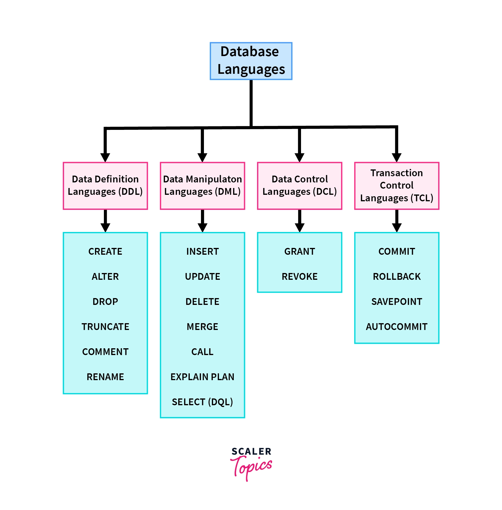
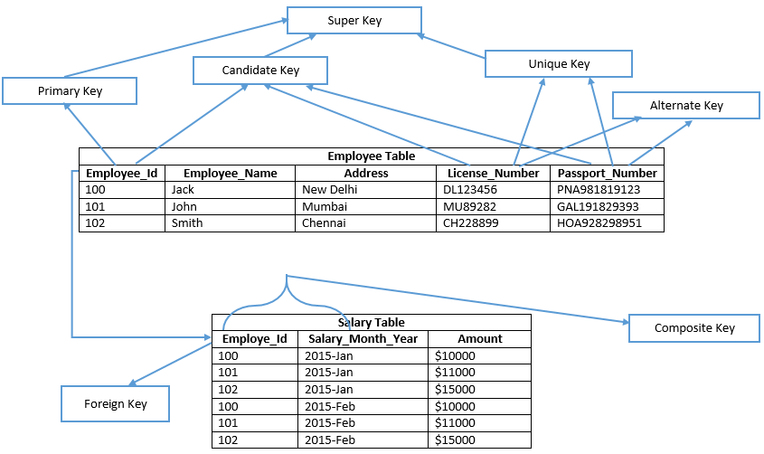
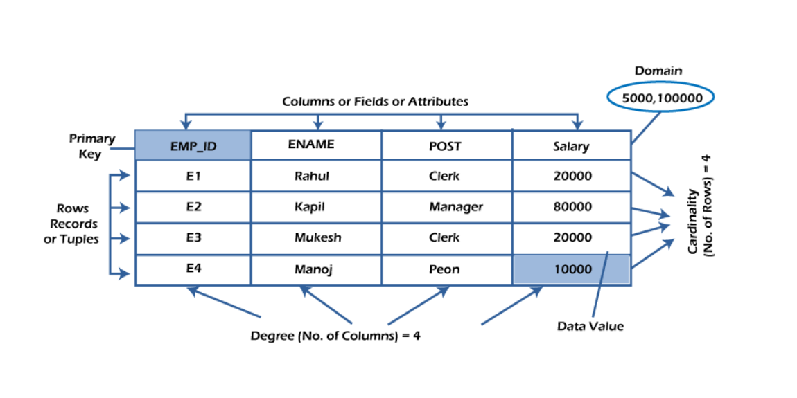
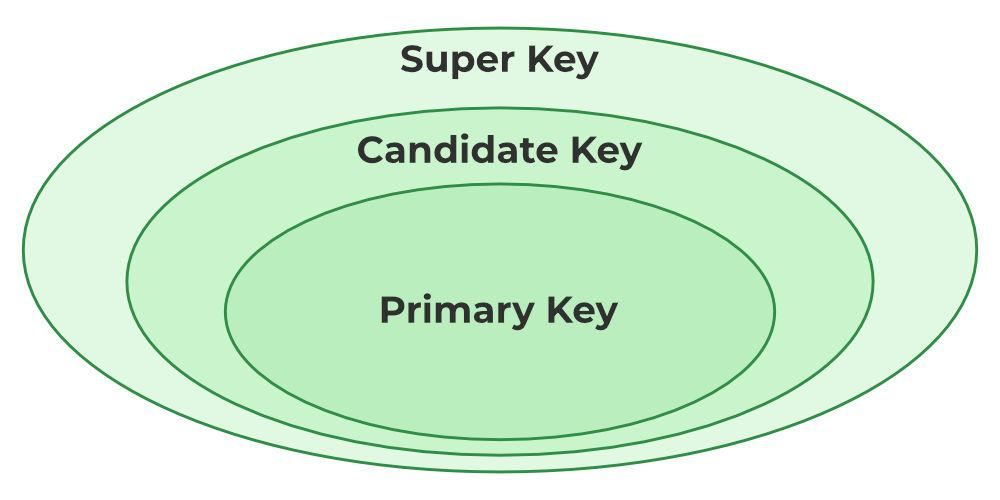

## সূচিপত্র (Topics Covered)

1. **Database, DBMS, RDBMS — সংজ্ঞা ও পার্থক্য**  
2. **Client-Server Architecture (ক্লায়েন্ট–সার্ভার আর্কিটেকচার)**  
3. **SQL vs NoSQL — কি এবং কেন**  
4. **Scaling — Vertical vs Horizontal**  
5. **তুলনা (DBMS vs RDBMS) ও (SQL vs NoSQL)**  
6. **Use Cases (কোন সিচুয়েশনে কোন DB ভালো)**  
7. **Which is Faster? (কখন কোনটা দ্রুত)**  
8. **Entity, Attributes, Keys (Primary Key, Foreign Key)**  
9. **Normalization (1NF, 2NF, 3NF, BCNF) — উদাহরণসহ**  
10. **JOIN এর ধরন ও উদাহরণ**  
11. **Quick Commands / Cheat-sheet**  
12. **অনুশীলনী (Practice tasks)**

 

### 1️⃣. Database (ডাটাবেস)
**Definition** : A database is an organized collection of data that can be easily accessed, managed, and updated.

>ডাটাবেস হলো একটি সংগঠিত ডেটার সংগ্রহ, যেখানে ডেটা সিস্টেমেটিকভাবে রাখা হয়  
যাতে সহজে খোঁজা, পরিবর্তন বা ব্যবহার করা যায়।

 

### 2️⃣  . DBMS (Database Management System)

**Definition :** A Database Management System (DBMS) is a software system that allows users to create, manage, update, and retrieve data from databases efficiently.  

It serves as a bridge between the data and the software application, ensuring data is organized and accessible.

**Example** : Oracle, MySQL, PostgreSQL, MongoDB

 

### 📌 Advantages of DBMS
1. **Efficient Data Management**: ডেটা insert, update, delete করা সহজ।
2. **Reduced Data Redundancy:** একই ডেটা বারবার রাখার দরকার হয় না।
3. **Data Integrity:** সঠিক ও নির্ভুল ডেটা রাখা যায়।
4. **Concurrency Control:** একসাথে একাধিক ইউজার ডেটা ব্যবহার করতে পারে।
5. **Security & Authorization:** ইউজার অনুযায়ী access দেওয়া যায় (Admin, User ইত্যাদি)।
6. **Backup & Recovery:** ডেটা হারালে সহজে রিকভার করা যায়।

 

### How DBMS Works with Server Relation

#### Client–Server Relationship (Diagrammatic Explanation)

1. Client / Application একটি **Query** পাঠায়।  
2. DBMS Server Query process করে।  
3. Server Database Storage থেকে ডাটা Retrieve করে।  
4. Result Client / Application এ পাঠানো হয়। 

 

### 3️⃣ RDBMS (Relational Database Management System)
**Definition:** RDBMS is a type of DBMS where data is stored in tables (rows and columns) and relationships are maintained using keys (`primary key`, `foreign key`).

👉 Example : MySQL, PostgreSQL, Oracle, SQL Server

 

### 📌 Advantages of RDBMS
1. **Structured Storage**: ডেটা টেবিলে (rows & columns) রাখায় বুঝতে সহজ।
2. **Relationship Handling**: Primary Key, Foreign Key ব্যবহার করে table গুলোকে connect করা যায়।
3. **SQL Support**: ডেটা ম্যানেজ করার জন্য powerful SQL query ব্যবহার করা যায়।
4. **Data Consistency**: Normalization থাকায় duplicate data কম হয়।
5. **Data Security**: Constraints, authentication, access control strong হয়।
6. **Scalability**: বড় ডেটা সহজে ম্যানেজ করা যায়।
7. **Transaction Support (ACID):**
    - Atomicity – সব বা কিছুই হবে
    - Consistency – valid state maintain করে
    - Isolation – এক ইউজারের কাজ অন্যকে disturb করবে না
    - Durability – power off হলেও data safe থাকে

 

### 🔄 Difference Between DBMS & RDBMS

| Feature          | DBMS                    | RDBMS                           |
|-----------------|------------------------|---------------------------------|
| **Structure**    | Data stored as files    | Data stored in tables (rows & columns) |
| **Relationship** | No relationship between data | Relationships maintained using keys |
| **Normalization**| Not supported           | Supported (reduces redundancy)  |
| **Data Security**| Basic                   | Stronger (constraints, access control) |
| **Examples**     | MongoDB, Redis          | MySQL, PostgreSQL, Oracle       |

 

### 5. Different Languages in DBMS

DBMS-এ সাধারণত ৪ ধরনের ভাষা (Languages) ব্যবহৃত হয়:  

1. **DDL (Data Definition Language)**  
   - Database define করার জন্য ব্যবহৃত হয়।  
   - **Commands:** `CREATE`, `ALTER`, `DROP`, `TRUNCATE`, `RENAME`, ইত্যাদি।  

2. **DML (Data Manipulation Language)**  
   - Database-এ থাকা data manipulate করার জন্য ব্যবহৃত হয়।  
   - **Commands:** `SELECT`, `UPDATE`, `INSERT`, `DELETE`, ইত্যাদি।  

3. **DCL (Data Control Language)**  
   - User permissions এবং database control করার জন্য ব্যবহৃত হয়।  
   - **Commands:** `GRANT`, `REVOKE`।  

4. **TCL (Transaction Control Language)**  
   - Database transaction manage করার জন্য ব্যবহৃত হয়।  
   - **Commands:** `COMMIT`, `ROLLBACK`, `SAVEPOINT`।  

### Diagram 

 

### Difference between DELETE, TRUNCATE, and DROP

| Command   | Description                                                                 | Example |
|-----------|-----------------------------------------------------------------------------|---------|
| **DELETE**  | Removes specific rows from a table. Can be rolled back using transactions. | `DELETE FROM employees WHERE department_id = 5;` |
| **TRUNCATE**| Removes all rows from a table but keeps the table structure. Faster than DELETE. | `TRUNCATE TABLE employees;` |
| **DROP**    | Removes the entire table along with its structure.                         | `DROP TABLE employees;` |

**Notes**  
- `DELETE` → নির্দিষ্ট row মুছে ফেলে, transaction rollback করা সম্ভব।  
- `TRUNCATE` → সব row মুছে ফেলে, কিন্তু table structure থাকে, দ্রুত।  
- `DROP` → পুরো table ও তার structure মুছে ফেলে।  

 

### 🔐 ACID Properties in DBMS

ACID হলো কিছু নিয়ম (principles) যা নিশ্চিত করে যে  
database transactions হবে **reliable**, **safe** এবং **data integrity** বজায় থাকবে।

**ACID = Atomicity, Consistency, Isolation, Durability**

 

#### 1️⃣ Atomicity (পরমাণুতা)

➡️ একটি transaction-এর সব step হয় **পুরোটা complete হবে**, না হলে **কিছুই হবে না**।

- Transaction মাঝপথে fail করলে → সব পরিবর্তন **rollback** হবে  
- **Partial update কখনোই হবে না**

#### Example
**Bank transfer করার সময়:**
- Account A থেকে টাকা কাটা  
- Account B তে টাকা যোগ  

>দুটোই একসাথে হবে, না হলে কোনোটাই হবে না

### 2️⃣ Consistency (সঙ্গতি)

➡️ Transaction শুরু হওয়ার আগে ও শেষ হওয়ার পরে database সবসময় **valid rules / constraints** follow করবে।

- Primary key, foreign key, balance rule ভাঙবে না  
- Database কখনোই **invalid state**-এ যাবে না

### Example
- মোট টাকা **negative** হতে পারবে না  
- Transaction শেষে total balance rule ঠিক থাকবে

### 3️⃣ Isolation (বিচ্ছিন্নতা)

➡️ একাধিক transaction একসাথে চললেও তারা একে অপরের কাজ **দেখতে বা প্রভাবিত করতে পারবে না**।

- একটি transaction-এর **partial data** অন্য transaction দেখবে না  
- সব transaction যেন **sequential** ভাবে চলছে—এমন feel দেয়

### Example
- Transaction চলাকালীন অন্য user **incomplete update** দেখতে পাবে না

### 4️⃣ Durability (দৃঢ়তা / স্থায়িত্ব)

➡️ একবার transaction **commit** হলে   system crash বা power failure হলেও data **permanently save** থাকবে।

### Example
- টাকা transfer হওয়ার পর system crash হলেও  
  updated balance ঠিকই থাকবে

 

### 📌 Quick Summary (Exam / Interview)

| Property    | Meaning |
|------------|--------|
| Atomicity  | সব step একসাথে হবে বা কিছুই হবে না (All steps of a transaction occur together or none occur) |
| Consistency| Transaction এর আগে ও পরে data valid থাকবে (Data remains valid before and after the transaction) |
| Isolation  | Transactions একে অপরের থেকে independent (Transactions execute independently without affecting each other)|
| Durability | Commit হলে data permanently save ( Once committed, data is permanently saved) |

 
 

### ✅ Different Types of Database Keys

Database keys are used to **uniquely identify records** and **establish relationships** between tables.  

| Key Type        | Description                                                                 |
|-----------------|-----------------------------------------------------------------------------|
| **Primary Key**  | Uniquely identifies each row. Cannot be NULL or duplicate.                 |
| **Foreign Key**  | References a primary key in another table to establish a relationship.     |
| **Candidate Key**| Any column (or set of columns) that could serve as a primary key.          |
| **Composite Key**| Primary key made of multiple columns.                                      |
| **Unique Key**   | Ensures uniqueness of values but allows one NULL value.                     |

**Summary:**  
- **Primary Key (প্রাথমিক কী):** প্রতিটি row আলাদা করে শনাক্ত করে।  
- **Foreign Key (বিদেশী কী):** অন্য table-এর primary key কে refer করে।  
- **Candidate Key (প্রার্থী কী):** primary key হিসেবে ব্যবহার করা যেতে পারে এমন column।  
- **Composite Key (যৌগিক কী):** একাধিক column দিয়ে primary key তৈরি।  
- **Unique Key (অনন্য কী):** value অনন্য রাখে, তবে একবার NULL থাকতে পারে।  

### Diagram 

---

 

### Database Table – Key Concepts

### 1️⃣ Table (টেবিল)
**Defination:**  
A table is a collection of related data stored in rows and columns.  
Each table represents an entity in the database.

### 2️⃣ Entity (এন্টিটি)
**Defination:**  
An entity is a real-world object or concept about which data is stored.  
Represented as a table in RDBMS.  

**Example:**  
Student, Course, Employee, Product ইত্যাদি।

### 3️⃣ Attribute (অ্যাট্রিবিউট)
**Defination:**  
Attributes are the properties or fields of an entity (columns of a table).  
  

**Example:**  
- Student Entity: StudentID, Name, Email, Age  
- Employee Entity: EmployeeID, Name, Salary

### 4️⃣ Primary Key (প্রাইমারি কি)
**Defination:**  
A column (or set of columns) that uniquely identifies each row in a table.  
Cannot be NULL and must be unique.  

**Example:**  
Student Table → StudentID is Primary Key

### 5️⃣ Foreign Key (ফরেন কি)
**Defination:**  
A column in one table that refers to the primary key of another table to establish a relationship.  

**Example:**  
- Enrollment Table → StudentID refers to Student(StudentID)  
- CourseID refers to Course(CourseID)

### 6️⃣ Candidate Key (ক্যান্ডিডেট কি)
**Defination:**  
A column or combination of columns that can qualify as a Primary Key.  
One of the candidate keys is chosen as the Primary Key.  

### 7️⃣ Alternate Key (অলটারনেট কি)
**Defination:**  
Candidate key that was not chosen as the primary key.  

### 8️⃣ Composite Key (কম্পোজিট কি)
**English:**  
Primary Key made of two or more columns.    
Primary Key যা একাধিক কলামের সংমিশ্রণ।  

**Example:**  
Enrollment Table → (StudentID + CourseID) = Composite Primary Key

### 9️⃣ Super Key (সুপার কি)
**English:**  
A set of one or more columns that uniquely identifies a row.  

### Diagram 

