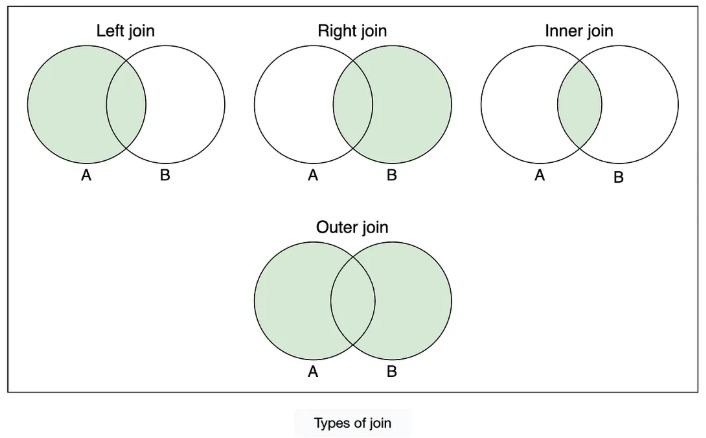

### 📌 What is JOIN?


**JOIN** is used in SQL to combine rows from two or more tables based on a related column between them.


>**JOIN** ব্যবহার করা হয় একাধিক টেবিলের ডেটা একত্রিত (combine) করার জন্য, যেখানে একটি কমন কলাম থাকে  
(সাধারণত **Primary Key ↔ Foreign Key**)।


### 📌 Types of JOIN


#### 1️⃣ INNER JOIN

Returns rows that have matching values in both tables.
 
>শুধু সেই রো দেখায় যেগুলো দুইটা টেবিলেই match করে।

✅ **Example:**
```sql
SELECT students.name, courses.course_name
FROM students
INNER JOIN courses
ON students.course_id = courses.course_id;
```

### 2️⃣ LEFT JOIN (LEFT OUTER JOIN)


Returns all rows from the left table, and matched rows from the right table.
Unmatched rows → NULL


>Left table এর সব ডেটা দেখাবে।
Right table এ match না থাকলে NULL দেখাবে।

✅ **Example**:

```sql
SELECT students.name, courses.course_name
FROM students
LEFT JOIN courses
ON students.course_id = courses.course_id;
```

### 3️⃣ RIGHT JOIN (RIGHT OUTER JOIN)


Returns all rows from the right table, and matched rows from the left table.
Unmatched → NULL


>Right table এর সব ডেটা দেখাবে।
Left table এ match না থাকলে NULL হবে।

✅ Example:
```sql
SELECT students.name, courses.course_name
FROM students
RIGHT JOIN courses
ON students.course_id = courses.course_id;
```

### 4️⃣ FULL JOIN (FULL OUTER JOIN)


Returns all rows when there is a match in either left or right table.


>Left এবং Right দুই টেবিলের সব ডেটা দেখাবে।
Match না থাকলে NULL হবে।

✅ Example:
```sql
SELECT students.name, courses.course_name
FROM students
FULL OUTER JOIN courses
ON students.course_id = courses.course_id;
```

### 5️⃣ CROSS JOIN


Returns Cartesian Product → every row from left × every row from right.


>Left টেবিলের প্রতিটি রো × Right টেবিলের প্রতিটি রো
→ সব সম্ভাব্য কম্বিনেশন দেখায়।

✅ Example:
```sql
SELECT students.name, courses.course_name
FROM students
CROSS JOIN courses;
```

### 6️⃣ SELF JOIN


A table joins with itself (alias is required).

>একটি টেবিল নিজের সাথেই join হয় (alias ব্যবহার করতে হয়)।

✅ Example:
```sql
SELECT A.name AS Student1, B.name AS Student2
FROM students A, students B
WHERE A.course_id = B.course_id;
```

📌 Quick Visual (Simplified)

- INNER JOIN → Common part only
- LEFT JOIN → All Left + Common
- RIGHT JOIN → All Right + Common
- FULL JOIN → All Left + All Right
- CROSS JOIN → Every Combination
- SELF JOIN → Same Table Join

### Diagram 


### 📊 Quick Summary Table

| JOIN Type   | English Meaning                     | বাংলা ব্যাখ্যা                         |
|------------|-------------------------------------|----------------------------------------|
| INNER JOIN | Only matching records               | শুধু মিল থাকা ডেটা                     |
| LEFT JOIN  | All from Left + matched from Right  | Left এর সব + Right এর মিল থাকা ডেটা   |
| RIGHT JOIN | All from Right + matched from Left  | Right এর সব + Left এর মিল থাকা ডেটা   |
| FULL JOIN  | All from both tables                | দুই দিকের সব ডেটা                      |
| CROSS JOIN | All possible combinations           | সব সম্ভাব্য কম্বিনেশন (Cartesian)     |
| SELF JOIN  | Table joined with itself            | টেবিল নিজেকে Join করা                 |

<br>

### ❓ Difference Between INNER JOIN and OUTER JOIN
#### ✅ INNER JOIN

Returns only matching records from both tables.
```sql
SELECT e.name, d.department_name
FROM employees e
INNER JOIN departments d
ON e.department_id = d.id;
```

#### ✅ OUTER JOIN

Includes non-matching records.

- LEFT JOIN → All records from left table + matching from right

- RIGHT JOIN → All records from right table + matching from left

- FULL OUTER JOIN → All records from both tables

<br>

### 🎯 Interview Tip

👉 INNER JOIN → “Only common data”

👉 OUTER JOIN → “Common + non-matching data”


<br>

### 📌 Interview Quick Questions

### Q1: What problem does normalization solve?
👉 Redundancy & inconsistency.

### Q2: Which is stronger, 3NF or BCNF?
👉 BCNF is stricter.

### Q3: Is normalization always good?
👉 Not always. Too much normalization may reduce performance (more JOINs).

<br>
<br>

### 🔔 Database Trigger

#### 1️⃣ What is a Trigger?

**Definition:**  
A trigger is a set of instructions in a database that automatically executes (or “fires”) when a specified event occurs on a table, such as `INSERT`, `UPDATE`, or `DELETE`.


>Trigger হলো ডাটাবেসে একটি স্বয়ংক্রিয় প্রক্রিয়া, যা নির্দিষ্ট ইভেন্ট (যেমন `INSERT`, `UPDATE`, `DELETE`) ঘটলে স্বয়ংক্রিয়ভাবে চালু হয়।


### 2️⃣ Key Points About Triggers

| Feature    | English Explanation                                      | Bangla Explanation                                      |
|-----------|----------------------------------------------------------|--------------------------------------------------------|
| Event     | Operation that fires the trigger (INSERT, UPDATE, DELETE) | যে অপারেশন trigger চালাবে                              |
| Timing    | BEFORE or AFTER the event                                | ইভেন্টের আগে বা পরে trigger চালানো                    |
| Table     | Trigger is associated with a specific table              | Trigger নির্দিষ্ট একটি টেবিলের সাথে যুক্ত থাকে        |
| Automation| Executes automatically                                   | ইউজারের হস্তক্ষেপ ছাড়া স্বয়ংক্রিয়ভাবে চলে             |

<br>

### 📌 Clustered vs Non-Clustered Index

### 1️⃣ What is an Index?

**Definition:**  
An index is a database object that improves the speed of data retrieval from a table.

 
>Index হলো একটি ডাটাবেস অবজেক্ট যা টেবিল থেকে ডেটা দ্রুত খুঁজে বের করতে সাহায্য করে।


### 2️⃣ Clustered Index

**Definition:**  
A clustered index determines the physical order of data in a table. Each table can have only one clustered index.

 
>Clustered Index টেবিলের ডেটার ফিজিক্যাল অর্ডার নির্ধারণ করে। একটি টেবিলে শুধুমাত্র একটি clustered index থাকতে পারে।

### Key Points
- Data stored in sorted order  
- Only one clustered index per table  
- Faster for range queries  

### Example
```sql
CREATE CLUSTERED INDEX idx_StudentID
ON Students(StudentID);
```
### 📌 Explanation (Non-Clustered Index)
Index stored separately and points to rows where the `Email` exists.

<br>
<br>

### 📌 Normalization and Denormalization

### 1️⃣ Normalization

###  Definition
Normalization is the process of organizing data in a database to reduce redundancy and improve data integrity by dividing data into multiple related tables.


>Normalization হলো ডেটাবেসে ডুপ্লিকেট ডেটা কমানো এবং ডেটার ইন্টেগ্রিটি বাড়ানোর জন্য ডেটাকে ছোট ছোট টেবিলে ভাগ করার প্রক্রিয়া।

### Purpose 
- Reduce data redundancy (ডেটার পুনরাবৃত্তি কমানো)
- Improve data integrity (ডেটার সঠিকতা নিশ্চিত করা)
- Easier maintenance (সহজে আপডেট/ডিলিট করা যায়)


### Example

#### Before Normalization (Single Table)

| StudentID | Name  | Course1 | Course2 |
|----------|-------|---------|---------|
| 1        | Arfan | Math    | English |
| 2        | Sarah | Science | Math    |

**Problem:** Course columns repeated → redundancy

#### After Normalization

**Students Table**

| StudentID | Name  |
|----------|-------|
| 1        | Arfan |
| 2        | Sarah |

**Enrollments Table**

| StudentID | Course  |
|----------|---------|
| 1        | Math    |
| 1        | English |
| 2        | Science |
| 2        | Math    |

### Normal Forms (NF)
- **1NF:** Remove repeating groups → Make atomic values
- **2NF:** Remove partial dependency
- **3NF:** Remove transitive dependency
- **Higher NFs:** BCNF, 4NF, 5NF

<br>

### 2️⃣ Denormalization

###  Definition
Denormalization is the process of combining tables or adding redundant data to improve read/query performance at the cost of some redundancy.


>Denormalization হলো পারফরম্যান্স বাড়ানোর জন্য টেবিলগুলোকে মিশিয়ে দেয়া বা পুনরাবৃত্তি ডেটা যোগ করার প্রক্রিয়া।

### Purpose 
- Improve query performance (কোয়েরি দ্রুত করতে)
- Reduce number of JOINs (JOIN কমাতে)
- Necessary in data warehousing / reporting

### Example

**Denormalized Table**

| StudentID | Name  | Course  |
|----------|-------|---------|
| 1        | Arfan | Math    |
| 1        | Arfan | English |
| 2        | Sarah | Science |
| 2        | Sarah | Math    |

**Advantage:** Simpler & faster queries  
**Disadvantage:** Data redundancy → harder to maintain

<br>

### 3️⃣ Quick Comparison Table

| Feature        | Normalization                    | Denormalization                      |
|---------------|----------------------------------|--------------------------------------|
| Goal          | Reduce redundancy                | Improve read/query performance       |
| Tables        | Many smaller related tables      | Fewer merged tables                  |
| Data Redundancy | Minimal                        | Increased                            |
| Performance   | Slower SELECT (more JOINs)       | Faster SELECT (less JOIN)            |
| Use Case      | OLTP systems (transactional DB)  | OLAP / Reporting / Data Warehousing  |

<br>
<br>


### 🗂️ DBMS Abstraction – Notes

### 📌 What is Abstraction in DBMS?

### defination
Abstraction in DBMS is the process of hiding the complex details of data storage from users and providing a simple interface to interact with data.

Users do not need to know how data is physically stored; they interact with it at a logical level.

>DBMS এ Abstraction হলো ডেটা স্টোরেজের জটিল বিষয়গুলো লুকানো এবং ইউজারদের জন্য একটি সহজ ইন্টারফেস প্রদানের প্রক্রিয়া।

>ইউজারদের জানা প্রয়োজন নেই ডেটা কীভাবে physically stored, তারা শুধু logical view তে ডেটার সাথে কাজ করে।


<br>

### 📌 Levels of Abstraction in DBMS

| Level          | Description                                              | বাংলা ব্যাখ্যা                                      |
|----------------|----------------------------------------------------------|----------------------------------------------------|
| Physical Level | How data is stored in files, blocks, indexes              | ডেটা হার্ডড্রাইভে কিভাবে সংরক্ষিত                  |
| Logical Level  | Tables, columns, relationships                            | ডেটা কিভাবে logically organized                    |
| View Level     | User-specific views (filtered data)                       | ইউজারের জন্য ডেটা কিভাবে দেখানো হবে               |


### 🔹 Example: Student Database

### Physical Level
- Data stored as disk blocks
- Indexed by `StudentID`

### Logical Level
- Tables: `Students(StudentID, Name, Age)`
- Tables: `Courses(CourseID, Name)`
- Relationship: `Enrollment(StudentID → CourseID)`

### View Level
- Show only Student Name and Course Name to instructors
- Hide sensitive data (Address, Phone Number)

<br>

### 📌 Why Abstraction is Important?

### Defination
- **Simplicity:** Users don’t deal with storage complexity
- **Security:** Sensitive data can be hidden
- **Data Independence:** Storage or schema changes don’t affect users

<br>

>- **সহজ ব্যবহার:** Storage complexity নিয়ে চিন্তা করতে হয় না
>- **সিকিউরিটি:** শুধুমাত্র অনুমোদিত ডেটা দেখানো হয়
>- **Data Independence:** Structure পরিবর্তন হলেও user view অপরিবর্তিত

